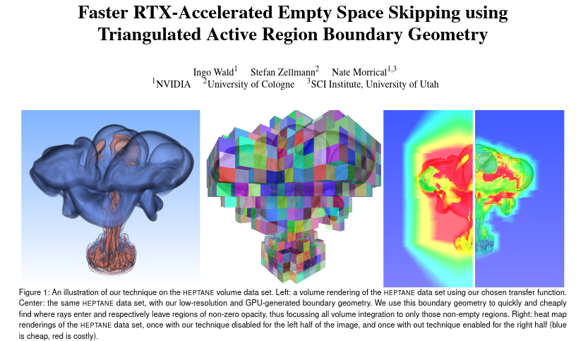

This repository contains sample code for our EGPGV 2021 Paper on
(OWL-based) OptiX-Accelerated Space Skipping for Direct Volume
Rendering (DVR):

<i>Ingo Wald, Stefan Zellmann, Nate Morrical. "Faster RTX-Accelerated
Empty Space Skipping using Triangulated Active Region Boundary
Geometry". Eurographics Symposium on Parallel Graphics and
Visualization (EGPGV 2021).`
https://www.researchgate.net/publication/351428822_Faster_RTX-Accelerated_Empty_Space_Skipping_using_Triangulated_Active_Region_Boundary_Geometry </i>

In addition to allowing readers of that paper to see what exactly our
system is doing, this also serves as a nice little example for how to
use OWL.

# Building and Dependencies

All rendering code in this paper uses OWL
(https://github.com/owl-project/owl); for the interactive Transfer
Function editor we use another helper project (using QT), named
cuteeOWL (https://github.com/owl-project/cuteeOWL). Both should be pulled in via git submodules (ie, youw ant to clone with "--recursive" flag, or do

	git submodule init
	git submodule update
	
after the initial clone.

You will obviously also need CUDA, OptiX, and QT, to build this.

Building is done with cmake; if you're not familiar with cmake I
suggest starting with the OWL project first, which has step by step
instructions on using cmake to build it.

# License

All code found in this repository is made available free of charge,
using an Apache 2 licence.

# Running

To run the sample, you'll first need to get/find a 3D volume data set
such as the flower, LLNL, etc. Once you have that, you can launch the
viewer as follows:

	./owlDVRViewer /space/structured/flower/flower_uint.raw -t uchar -dims 1024 1024 1024 
	
This assumes a "raw" binary volume format (ie, no header in that data
set; dimensions and type are specified via `-dims` and `-t`,
respectively).

Once the viewer opens, you can then 'draw' into the transfer function
editor with the mouse to change the alpha value(s) of the transfer
fucntions. You can also save a transfer function (press "T"), and
specify a saved one during launch (`-xf <savedXF.xf>`). 

Similarly, you can create a screenshot (press "!"), or print the
current camera config (press "C"); copy and pasting the printed camera
config (`--camera .... -fovy ...`) will then initialize the next run's
camera to what it was when printed.
